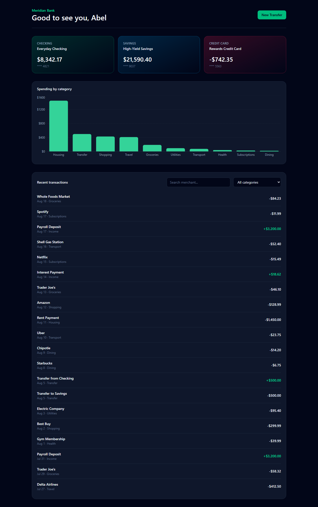

# Meridian Bank Dashboard

A responsive fintech account dashboard: balance cards across checking, savings, and credit accounts, a spending breakdown chart, a searchable/filterable transaction list, and a transfer form with real client-side validation.

**Live demo:** _add your deployed URL here_



## What it does

- **Balance cards** for three account types (checking, savings, credit), pulled from a mock REST API.
- **Spending by category** chart (Recharts) computed client-side from transaction history.
- **Transaction list** with live search-by-merchant and category filtering.
- **Transfer form** (React Hook Form + Zod) that validates account selection, amount, and note length, then posts a new transaction and updates both account balances.
- Loading, empty, and error states for every data-driven section — nothing renders blank while data is in flight.

## Stack

- React 19 + Vite
- Tailwind CSS 4
- React Hook Form + Zod for form state and schema validation
- Recharts for the spending chart
- Axios for API calls
- [json-server](https://github.com/typicode/json-server) as a mock REST API (`db.json`)

## Running locally

```bash
npm install

# terminal 1: mock API on http://localhost:4000
npm run mock-api

# terminal 2: dev server on http://localhost:5173
npm run dev
```

## What I learned

Building the transfer flow was the most interesting part: it needed to update two resources (the new transaction and both account balances) after a single form submission, while keeping the UI in a clean loading/error state throughout. Structuring data-fetching as small hooks (`useAccounts`, `useTransactions`) with their own `refetch` made it straightforward to re-sync the dashboard after a mutation without over-engineering a global store for a project this size.
